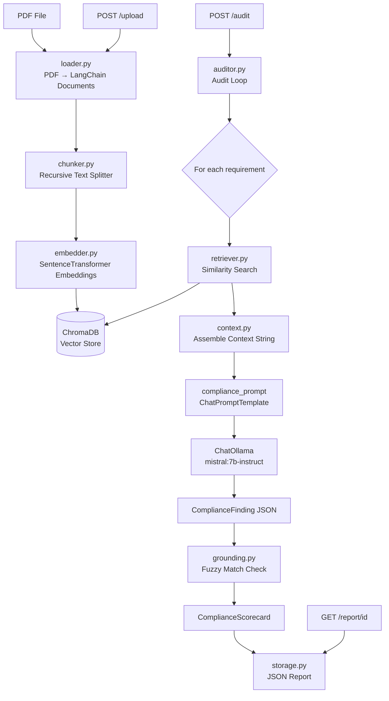

# Financial Compliance Auditor Implementation Plan

> **For agentic workers:** REQUIRED SUB-SKILL: Use superpowers:subagent-driven-development (recommended) or superpowers:executing-plans to implement this plan task-by-task. Steps use checkbox (`- [ ]`) syntax for tracking.

**Goal:** Build an end-to-end RAG system that ingests SEC 10-K/10-Q PDFs, indexes them in ChromaDB, and generates a source-grounded compliance scorecard via a FastAPI service.

**Architecture:** PDFs are loaded, chunked, embedded, and stored in ChromaDB with rich metadata. At audit time, each compliance requirement becomes a retrieval query; top-k chunks are assembled as context for an instruction-tuned LLM that returns structured JSON. Every finding is post-hoc grounding-checked by fuzzy-matching the quoted evidence back to the retrieved source chunks.

**Tech Stack:** Python 3.11+, LangChain (LCEL), ChromaDB, sentence-transformers (`all-MiniLM-L6-v2`), Ollama (`mistral:7b-instruct`), FastAPI + Pydantic v2, pypdf, thefuzz, fpdf2 (test fixture), pytest.

---

## File Map

```
FinComplianceAuditor/
├── requirements.txt
├── app/
│   ├── __init__.py
│   ├── main.py                    # FastAPI app + lifespan
│   ├── config.py                  # Pydantic Settings
│   ├── models.py                  # Shared Pydantic schemas
│   ├── ingestion/
│   │   ├── __init__.py
│   │   ├── loader.py              # PDF → list[Document]
│   │   ├── chunker.py             # list[Document] → chunked list[Document]
│   │   └── embedder.py            # embed + store in ChromaDB
│   ├── retrieval/
│   │   ├── __init__.py
│   │   ├── retriever.py           # query + doc_id → top-k Documents
│   │   └── context.py             # list[Document] → formatted string
│   ├── llm/
│   │   ├── __init__.py
│   │   ├── client.py              # ChatOllama factory
│   │   └── prompts.py             # compliance_prompt template
│   ├── audit/
│   │   ├── __init__.py
│   │   ├── requirements.py        # COMPLIANCE_REQUIREMENTS list
│   │   ├── grounding.py           # fuzzy evidence verification
│   │   └── auditor.py             # run_audit() → ComplianceScorecard
│   └── api/
│       ├── __init__.py
│       ├── routes.py              # FastAPI router
│       ├── storage.py             # save/load ComplianceScorecard JSON
│       └── doc_registry.py        # doc_id → {doc_name, company, filing_year}
├── tests/
│   ├── __init__.py
│   ├── conftest.py                # sample_pdf_path fixture
│   ├── test_ingestion/
│   │   ├── __init__.py
│   │   ├── test_loader.py
│   │   ├── test_chunker.py
│   │   └── test_embedder.py
│   ├── test_retrieval/
│   │   ├── __init__.py
│   │   ├── test_retriever.py
│   │   └── test_context.py
│   ├── test_llm/
│   │   ├── __init__.py
│   │   └── test_prompts.py
│   ├── test_audit/
│   │   ├── __init__.py
│   │   ├── test_requirements.py
│   │   ├── test_grounding.py
│   │   └── test_auditor.py
│   └── test_api/
│       ├── __init__.py
│       ├── test_storage.py
│       └── test_routes.py
└── scripts/
    └── evaluate.py
```

---

## Task 1: Project Bootstrap

**Files:**
- Create: `requirements.txt`
- Create: `app/__init__.py`, `app/ingestion/__init__.py`, `app/retrieval/__init__.py`, `app/llm/__init__.py`, `app/audit/__init__.py`, `app/api/__init__.py`
- Create: `app/config.py`
- Create: `app/models.py`
- Create: `tests/__init__.py`, `tests/test_ingestion/__init__.py`, `tests/test_retrieval/__init__.py`, `tests/test_llm/__init__.py`, `tests/test_audit/__init__.py`, `tests/test_api/__init__.py`
- Create: `tests/conftest.py`

- [ ] **Step 1: Create directory structure**

```bash
cd /Users/MMCHAOU/Downloads/oldgits/FinComplianceAuditor
mkdir -p app/ingestion app/retrieval app/llm app/audit app/api
mkdir -p tests/test_ingestion tests/test_retrieval tests/test_llm tests/test_audit tests/test_api
mkdir -p scripts data/chroma data/reports
touch app/__init__.py app/ingestion/__init__.py app/retrieval/__init__.py
touch app/llm/__init__.py app/audit/__init__.py app/api/__init__.py
touch tests/__init__.py tests/test_ingestion/__init__.py tests/test_retrieval/__init__.py
touch tests/test_llm/__init__.py tests/test_audit/__init__.py tests/test_api/__init__.py
```

- [ ] **Step 2: Write `requirements.txt`**

```
langchain>=0.3.0
langchain-community>=0.3.0
langchain-chroma>=0.1.4
langchain-huggingface>=0.1.0
langchain-ollama>=0.2.0
langchain-text-splitters>=0.3.0
chromadb>=0.5.0
sentence-transformers>=3.0.0
fastapi>=0.115.0
uvicorn[standard]>=0.32.0
pydantic>=2.7.0
pydantic-settings>=2.3.0
pypdf>=5.0.0
python-multipart>=0.0.12
thefuzz>=0.22.0
fpdf2>=2.8.0
pytest>=8.0.0
pytest-asyncio>=0.24.0
httpx>=0.27.0
```

- [ ] **Step 3: Write `app/config.py`**

```python
from pydantic_settings import BaseSettings


class Settings(BaseSettings):
    chroma_persist_dir: str = "./data/chroma"
    reports_dir: str = "./data/reports"
    embedding_model: str = "all-MiniLM-L6-v2"
    ollama_model: str = "mistral:7b-instruct"
    ollama_base_url: str = "http://localhost:11434"
    chunk_size: int = 512
    chunk_overlap: int = 64
    retrieval_top_k: int = 5
    confidence_threshold: float = 0.6
    grounding_min_ratio: int = 75


settings = Settings()
```

- [ ] **Step 4: Write `app/models.py`**

```python
from __future__ import annotations
from datetime import datetime
from typing import Literal
from pydantic import BaseModel, Field


class ComplianceFinding(BaseModel):
    requirement: str
    status: Literal["Pass", "Fail", "Insufficient Evidence"]
    confidence: float = Field(ge=0.0, le=1.0)
    page: int | None = None
    evidence: str


class ComplianceScorecard(BaseModel):
    id: str
    company: str
    filing_year: int
    doc_name: str
    score: float
    findings: list[ComplianceFinding]
    created_at: datetime


class UploadResponse(BaseModel):
    doc_id: str
    doc_name: str
    company: str
    filing_year: int
    chunks_stored: int


class AuditRequest(BaseModel):
    doc_id: str


class AuditResponse(BaseModel):
    report_id: str
    status: str


class HealthResponse(BaseModel):
    status: str
    version: str
```

- [ ] **Step 5: Write `tests/conftest.py`**

```python
import pytest
from fpdf import FPDF
from pathlib import Path


@pytest.fixture
def sample_pdf_path(tmp_path) -> Path:
    pdf = FPDF()
    pdf.add_page()
    pdf.set_font("Helvetica", size=11)
    lines = [
        "ITEM 1A. RISK FACTORS",
        "The company faces significant market, operational, and regulatory risks.",
        "Competition in our industry is intense and may reduce our margins.",
        "ITEM 3. LEGAL PROCEEDINGS",
        "The company is not party to any material legal proceedings as of this date.",
        "ITEM 7. MANAGEMENT DISCUSSION AND ANALYSIS",
        "Revenue increased 12 percent year-over-year driven by strong product demand.",
        "Operating income improved due to cost discipline and scale efficiencies.",
        "LIQUIDITY AND CAPITAL RESOURCES",
        "As of December 31 2023 cash and equivalents totaled 5.2 billion dollars.",
        "We believe our current liquidity is sufficient to fund operations for 12 months.",
        "REVENUE RECOGNITION",
        "Revenue is recognized when performance obligations are satisfied per ASC 606.",
        "We allocate transaction price to each distinct performance obligation.",
        "INDEPENDENT AUDITORS REPORT",
        "Ernst and Young LLP served as independent registered public accounting firm.",
        "In our opinion the financial statements present fairly in all material respects.",
    ]
    for line in lines:
        pdf.cell(0, 8, text=line, new_x="LMARGIN", new_y="NEXT")
    out = tmp_path / "test_filing.pdf"
    pdf.output(str(out))
    return out
```

- [ ] **Step 6: Install dependencies and verify**

```bash
cd /Users/MMCHAOU/Downloads/oldgits/FinComplianceAuditor
python -m venv .venv && source .venv/bin/activate
pip install -r requirements.txt
python -c "import langchain, chromadb, fastapi, pypdf; print('OK')"
```

Expected: `OK`

- [ ] **Step 7: Commit**

```bash
git init
git add requirements.txt app/ tests/conftest.py tests/__init__.py
git commit -m "feat: project bootstrap — config, models, dependencies"
```

---

## Task 2: PDF Loader

**Files:**
- Create: `app/ingestion/loader.py`
- Create: `tests/test_ingestion/test_loader.py`

- [ ] **Step 1: Write the failing test**

```python
# tests/test_ingestion/test_loader.py
from app.ingestion.loader import load_pdf


def test_load_pdf_returns_documents(sample_pdf_path):
    docs = load_pdf(sample_pdf_path)
    assert len(docs) >= 1


def test_load_pdf_documents_have_page_number(sample_pdf_path):
    docs = load_pdf(sample_pdf_path)
    for doc in docs:
        assert "page_number" in doc.metadata
        assert isinstance(doc.metadata["page_number"], int)


def test_load_pdf_documents_have_source(sample_pdf_path):
    docs = load_pdf(sample_pdf_path)
    for doc in docs:
        assert "source" in doc.metadata


def test_load_pdf_content_is_nonempty(sample_pdf_path):
    docs = load_pdf(sample_pdf_path)
    for doc in docs:
        assert doc.page_content.strip() != ""
```

- [ ] **Step 2: Run to verify failure**

```bash
pytest tests/test_ingestion/test_loader.py -v
```

Expected: `ImportError: cannot import name 'load_pdf'`

- [ ] **Step 3: Write `app/ingestion/loader.py`**

```python
from pathlib import Path
from pypdf import PdfReader
from langchain_core.documents import Document


def load_pdf(file_path: str | Path) -> list[Document]:
    reader = PdfReader(str(file_path))
    docs = []
    for i, page in enumerate(reader.pages):
        text = page.extract_text() or ""
        if text.strip():
            docs.append(Document(
                page_content=text,
                metadata={"page_number": i + 1, "source": str(file_path)},
            ))
    return docs
```

- [ ] **Step 4: Run tests to verify they pass**

```bash
pytest tests/test_ingestion/test_loader.py -v
```

Expected: `4 passed`

- [ ] **Step 5: Commit**

```bash
git add app/ingestion/loader.py tests/test_ingestion/test_loader.py
git commit -m "feat: PDF loader — pypdf → LangChain Documents with page metadata"
```

---

## Task 3: Text Chunker

**Files:**
- Create: `app/ingestion/chunker.py`
- Create: `tests/test_ingestion/test_chunker.py`

- [ ] **Step 1: Write the failing test**

```python
# tests/test_ingestion/test_chunker.py
from langchain_core.documents import Document
from app.ingestion.chunker import chunk_documents


def _make_doc(text: str, page: int = 1) -> Document:
    return Document(page_content=text, metadata={"page_number": page, "source": "test.pdf"})


def test_chunk_documents_returns_nonempty_list():
    docs = [_make_doc("word " * 600)]
    chunks = chunk_documents(docs)
    assert len(chunks) > 1


def test_chunks_have_chunk_id():
    docs = [_make_doc("word " * 600)]
    chunks = chunk_documents(docs)
    for chunk in chunks:
        assert "chunk_id" in chunk.metadata
        assert isinstance(chunk.metadata["chunk_id"], str)


def test_chunks_preserve_source_metadata():
    docs = [_make_doc("word " * 600)]
    chunks = chunk_documents(docs)
    for chunk in chunks:
        assert chunk.metadata["source"] == "test.pdf"


def test_single_short_doc_produces_one_chunk():
    docs = [_make_doc("short text")]
    chunks = chunk_documents(docs)
    assert len(chunks) == 1
```

- [ ] **Step 2: Run to verify failure**

```bash
pytest tests/test_ingestion/test_chunker.py -v
```

Expected: `ImportError: cannot import name 'chunk_documents'`

- [ ] **Step 3: Write `app/ingestion/chunker.py`**

```python
from langchain_text_splitters import RecursiveCharacterTextSplitter
from langchain_core.documents import Document
from app.config import settings


def chunk_documents(docs: list[Document]) -> list[Document]:
    splitter = RecursiveCharacterTextSplitter(
        chunk_size=settings.chunk_size,
        chunk_overlap=settings.chunk_overlap,
        separators=["\n\n", "\n", " ", ""],
    )
    chunks = splitter.split_documents(docs)
    for i, chunk in enumerate(chunks):
        chunk.metadata["chunk_id"] = f"{chunk.metadata.get('source', 'unknown')}_{i:04d}"
    return chunks
```

- [ ] **Step 4: Run tests to verify they pass**

```bash
pytest tests/test_ingestion/test_chunker.py -v
```

Expected: `4 passed`

- [ ] **Step 5: Commit**

```bash
git add app/ingestion/chunker.py tests/test_ingestion/test_chunker.py
git commit -m "feat: text chunker — recursive splitter with chunk_id metadata"
```

---

## Task 4: ChromaDB Embedder

**Files:**
- Create: `app/ingestion/embedder.py`
- Create: `tests/test_ingestion/test_embedder.py`

- [ ] **Step 1: Write the failing test**

```python
# tests/test_ingestion/test_embedder.py
from unittest.mock import MagicMock, patch
from langchain_core.documents import Document
from app.ingestion.embedder import store_chunks


def _make_chunks(n: int = 3) -> list[Document]:
    return [
        Document(
            page_content=f"chunk content {i}",
            metadata={"page_number": 1, "source": "test.pdf", "chunk_id": f"test_{i:04d}"},
        )
        for i in range(n)
    ]


@patch("app.ingestion.embedder.get_vector_store")
def test_store_chunks_returns_count(mock_vs_factory):
    mock_vs = MagicMock()
    mock_vs_factory.return_value = mock_vs
    chunks = _make_chunks(3)
    result = store_chunks(chunks, company_name="Acme", filing_year=2023, doc_name="acme_10k.pdf", doc_id="abc123")
    assert result == 3


@patch("app.ingestion.embedder.get_vector_store")
def test_store_chunks_calls_add_documents(mock_vs_factory):
    mock_vs = MagicMock()
    mock_vs_factory.return_value = mock_vs
    chunks = _make_chunks(2)
    store_chunks(chunks, company_name="Acme", filing_year=2023, doc_name="acme_10k.pdf", doc_id="abc123")
    mock_vs.add_documents.assert_called_once()


@patch("app.ingestion.embedder.get_vector_store")
def test_store_chunks_enriches_metadata(mock_vs_factory):
    mock_vs = MagicMock()
    mock_vs_factory.return_value = mock_vs
    chunks = _make_chunks(1)
    store_chunks(chunks, company_name="Acme", filing_year=2023, doc_name="acme_10k.pdf", doc_id="abc123")
    added_docs = mock_vs.add_documents.call_args[0][0]
    assert added_docs[0].metadata["company_name"] == "Acme"
    assert added_docs[0].metadata["filing_year"] == 2023
    assert added_docs[0].metadata["doc_id"] == "abc123"
```

- [ ] **Step 2: Run to verify failure**

```bash
pytest tests/test_ingestion/test_embedder.py -v
```

Expected: `ImportError: cannot import name 'store_chunks'`

- [ ] **Step 3: Write `app/ingestion/embedder.py`**

```python
from langchain_chroma import Chroma
from langchain_huggingface import HuggingFaceEmbeddings
from langchain_core.documents import Document
from app.config import settings


def get_embedding_function() -> HuggingFaceEmbeddings:
    return HuggingFaceEmbeddings(model_name=settings.embedding_model)


def get_vector_store() -> Chroma:
    return Chroma(
        collection_name="filings",
        embedding_function=get_embedding_function(),
        persist_directory=settings.chroma_persist_dir,
    )


def store_chunks(
    chunks: list[Document],
    company_name: str,
    filing_year: int,
    doc_name: str,
    doc_id: str,
) -> int:
    for chunk in chunks:
        chunk.metadata.update({
            "company_name": company_name,
            "filing_year": filing_year,
            "doc_name": doc_name,
            "doc_id": doc_id,
        })
    vs = get_vector_store()
    vs.add_documents(chunks)
    return len(chunks)
```

- [ ] **Step 4: Run tests to verify they pass**

```bash
pytest tests/test_ingestion/test_embedder.py -v
```

Expected: `3 passed`

- [ ] **Step 5: Commit**

```bash
git add app/ingestion/embedder.py tests/test_ingestion/test_embedder.py
git commit -m "feat: ChromaDB embedder — store chunks with enriched metadata"
```

---

## Task 5: Retriever

**Files:**
- Create: `app/retrieval/retriever.py`
- Create: `tests/test_retrieval/test_retriever.py`

- [ ] **Step 1: Write the failing test**

```python
# tests/test_retrieval/test_retriever.py
from unittest.mock import MagicMock, patch
from langchain_core.documents import Document
from app.retrieval.retriever import retrieve


def _make_doc(text: str, doc_id: str = "abc123") -> Document:
    return Document(page_content=text, metadata={"doc_id": doc_id, "page_number": 1})


@patch("app.retrieval.retriever.get_vector_store")
def test_retrieve_returns_documents(mock_vs_factory):
    mock_vs = MagicMock()
    mock_vs.similarity_search.return_value = [_make_doc("risk factors text")]
    mock_vs_factory.return_value = mock_vs
    results = retrieve("risk factors", "abc123")
    assert len(results) == 1
    assert results[0].page_content == "risk factors text"


@patch("app.retrieval.retriever.get_vector_store")
def test_retrieve_passes_doc_id_filter(mock_vs_factory):
    mock_vs = MagicMock()
    mock_vs.similarity_search.return_value = []
    mock_vs_factory.return_value = mock_vs
    retrieve("revenue recognition", "xyz789")
    call_kwargs = mock_vs.similarity_search.call_args[1]
    assert call_kwargs["filter"] == {"doc_id": "xyz789"}


@patch("app.retrieval.retriever.get_vector_store")
def test_retrieve_uses_configured_top_k(mock_vs_factory):
    mock_vs = MagicMock()
    mock_vs.similarity_search.return_value = []
    mock_vs_factory.return_value = mock_vs
    retrieve("liquidity", "abc123")
    call_kwargs = mock_vs.similarity_search.call_args[1]
    assert call_kwargs["k"] == 5  # default from settings
```

- [ ] **Step 2: Run to verify failure**

```bash
pytest tests/test_retrieval/test_retriever.py -v
```

Expected: `ImportError: cannot import name 'retrieve'`

- [ ] **Step 3: Write `app/retrieval/retriever.py`**

```python
from langchain_core.documents import Document
from app.ingestion.embedder import get_vector_store
from app.config import settings


def retrieve(query: str, doc_id: str, top_k: int | None = None) -> list[Document]:
    k = top_k if top_k is not None else settings.retrieval_top_k
    vs = get_vector_store()
    return vs.similarity_search(query, k=k, filter={"doc_id": doc_id})
```

- [ ] **Step 4: Run tests to verify they pass**

```bash
pytest tests/test_retrieval/test_retriever.py -v
```

Expected: `3 passed`

- [ ] **Step 5: Commit**

```bash
git add app/retrieval/retriever.py tests/test_retrieval/test_retriever.py
git commit -m "feat: retriever — ChromaDB similarity search filtered by doc_id"
```

---

## Task 6: Context Assembler

**Files:**
- Create: `app/retrieval/context.py`
- Create: `tests/test_retrieval/test_context.py`

- [ ] **Step 1: Write the failing test**

```python
# tests/test_retrieval/test_context.py
from langchain_core.documents import Document
from app.retrieval.context import assemble_context


def test_assemble_context_includes_page_numbers():
    docs = [
        Document(page_content="risk disclosure text", metadata={"page_number": 12}),
        Document(page_content="liquidity text", metadata={"page_number": 45}),
    ]
    result = assemble_context(docs)
    assert "[Page 12]" in result
    assert "[Page 45]" in result


def test_assemble_context_includes_content():
    docs = [Document(page_content="revenue recognition policy", metadata={"page_number": 1})]
    result = assemble_context(docs)
    assert "revenue recognition policy" in result


def test_assemble_context_separates_chunks():
    docs = [
        Document(page_content="chunk one", metadata={"page_number": 1}),
        Document(page_content="chunk two", metadata={"page_number": 2}),
    ]
    result = assemble_context(docs)
    assert "---" in result


def test_assemble_context_handles_missing_page():
    docs = [Document(page_content="some text", metadata={})]
    result = assemble_context(docs)
    assert "[Page ?]" in result
```

- [ ] **Step 2: Run to verify failure**

```bash
pytest tests/test_retrieval/test_context.py -v
```

Expected: `ImportError: cannot import name 'assemble_context'`

- [ ] **Step 3: Write `app/retrieval/context.py`**

```python
from langchain_core.documents import Document


def assemble_context(docs: list[Document]) -> str:
    parts = []
    for doc in docs:
        page = doc.metadata.get("page_number", "?")
        parts.append(f"[Page {page}]\n{doc.page_content}")
    return "\n\n---\n\n".join(parts)
```

- [ ] **Step 4: Run tests to verify they pass**

```bash
pytest tests/test_retrieval/test_context.py -v
```

Expected: `4 passed`

- [ ] **Step 5: Commit**

```bash
git add app/retrieval/context.py tests/test_retrieval/test_context.py
git commit -m "feat: context assembler — format retrieved docs for LLM prompt"
```

---

## Task 7: LLM Client and Prompts

**Files:**
- Create: `app/llm/client.py`
- Create: `app/llm/prompts.py`
- Create: `tests/test_llm/test_prompts.py`

- [ ] **Step 1: Write the failing test**

```python
# tests/test_llm/test_prompts.py
from app.llm.prompts import compliance_prompt


def test_prompt_has_system_and_human_messages():
    messages = compliance_prompt.messages
    roles = [m.__class__.__name__ for m in messages]
    assert "SystemMessagePromptTemplate" in roles
    assert "HumanMessagePromptTemplate" in roles


def test_prompt_requires_requirement_and_context():
    assert "requirement" in compliance_prompt.input_variables
    assert "context" in compliance_prompt.input_variables


def test_prompt_renders_with_values():
    rendered = compliance_prompt.format_messages(
        requirement="Risk factors must be disclosed",
        context="[Page 12]\nThe company faces market risks.",
    )
    full_text = " ".join(m.content for m in rendered)
    assert "Risk factors must be disclosed" in full_text
    assert "The company faces market risks" in full_text
```

- [ ] **Step 2: Run to verify failure**

```bash
pytest tests/test_llm/test_prompts.py -v
```

Expected: `ImportError: cannot import name 'compliance_prompt'`

- [ ] **Step 3: Write `app/llm/prompts.py`**

```python
from langchain_core.prompts import ChatPromptTemplate

_SYSTEM = """\
You are a financial compliance auditor reviewing SEC filings.
You will be given a compliance requirement and excerpts from a financial filing.
Respond ONLY with valid JSON matching this exact schema:
{{
  "requirement": "<the requirement text>",
  "status": "Pass" | "Fail" | "Insufficient Evidence",
  "confidence": <float 0.0-1.0>,
  "page": <int or null>,
  "evidence": "<verbatim quote from the provided context, or empty string>"
}}
Rules:
- evidence MUST be a verbatim quote from the provided context.
- If no relevant evidence exists, set status to "Insufficient Evidence" and evidence to "".
- confidence reflects certainty given the evidence found.
- Do not introduce any information not present in the provided context.
- Output raw JSON only — no markdown fences, no commentary."""

_HUMAN = """\
Compliance Requirement: {requirement}

Filing Excerpts:
{context}

Evaluate whether this requirement is met. Output JSON only."""

compliance_prompt = ChatPromptTemplate.from_messages([
    ("system", _SYSTEM),
    ("human", _HUMAN),
])
```

- [ ] **Step 4: Write `app/llm/client.py`**

```python
from langchain_ollama import ChatOllama
from langchain_core.language_models import BaseChatModel
from app.config import settings


def get_llm() -> BaseChatModel:
    return ChatOllama(
        model=settings.ollama_model,
        base_url=settings.ollama_base_url,
        temperature=0,
        format="json",
    )
```

- [ ] **Step 5: Run tests to verify they pass**

```bash
pytest tests/test_llm/test_prompts.py -v
```

Expected: `3 passed`

- [ ] **Step 6: Commit**

```bash
git add app/llm/client.py app/llm/prompts.py tests/test_llm/test_prompts.py
git commit -m "feat: LLM client (Ollama) + compliance audit prompt template"
```

---

## Task 8: Compliance Requirements

**Files:**
- Create: `app/audit/requirements.py`
- Create: `tests/test_audit/test_requirements.py`

- [ ] **Step 1: Write the failing test**

```python
# tests/test_audit/test_requirements.py
from app.audit.requirements import COMPLIANCE_REQUIREMENTS, ComplianceRequirement


def test_requirements_is_nonempty():
    assert len(COMPLIANCE_REQUIREMENTS) >= 6


def test_each_requirement_has_name_and_query():
    for req in COMPLIANCE_REQUIREMENTS:
        assert isinstance(req, ComplianceRequirement)
        assert req.name.strip() != ""
        assert req.query.strip() != ""
        assert req.description.strip() != ""


def test_weights_are_positive():
    for req in COMPLIANCE_REQUIREMENTS:
        assert req.weight > 0


def test_required_sec_items_present():
    names = {req.name for req in COMPLIANCE_REQUIREMENTS}
    assert "Risk Factors" in names
    assert "Management Discussion and Analysis" in names
    assert "Liquidity and Capital Resources" in names
    assert "Revenue Recognition" in names
    assert "Legal Proceedings" in names
    assert "Auditor Information" in names
```

- [ ] **Step 2: Run to verify failure**

```bash
pytest tests/test_audit/test_requirements.py -v
```

Expected: `ImportError: cannot import name 'COMPLIANCE_REQUIREMENTS'`

- [ ] **Step 3: Write `app/audit/requirements.py`**

```python
from dataclasses import dataclass, field


@dataclass
class ComplianceRequirement:
    name: str
    description: str
    query: str
    weight: float = 1.0


COMPLIANCE_REQUIREMENTS: list[ComplianceRequirement] = [
    ComplianceRequirement(
        name="Risk Factors",
        description="Risk factors must be disclosed (SEC Item 1A)",
        query="risk factors material risks uncertainties business operations competition",
        weight=1.5,
    ),
    ComplianceRequirement(
        name="Management Discussion and Analysis",
        description="MD&A section must be present and substantive (SEC Item 7)",
        query="management discussion analysis results of operations financial condition performance",
        weight=1.5,
    ),
    ComplianceRequirement(
        name="Liquidity and Capital Resources",
        description="Liquidity and capital resources discussion required (SEC Item 7)",
        query="liquidity capital resources cash flow operating activities working capital",
        weight=1.0,
    ),
    ComplianceRequirement(
        name="Revenue Recognition",
        description="Revenue recognition accounting policy must be disclosed (ASC 606)",
        query="revenue recognition policy performance obligations transaction price contract",
        weight=1.0,
    ),
    ComplianceRequirement(
        name="Legal Proceedings",
        description="Material legal proceedings must be disclosed (SEC Item 3)",
        query="legal proceedings litigation lawsuits claims regulatory actions pending",
        weight=1.0,
    ),
    ComplianceRequirement(
        name="Auditor Information",
        description="Independent auditor information required (SEC Item 8)",
        query="independent registered public accounting firm auditor report opinion financial statements",
        weight=1.0,
    ),
    ComplianceRequirement(
        name="Going Concern",
        description="Going concern risks must be evaluated if applicable",
        query="going concern substantial doubt ability to continue as a going concern operations",
        weight=0.5,
    ),
]
```

- [ ] **Step 4: Run tests to verify they pass**

```bash
pytest tests/test_audit/test_requirements.py -v
```

Expected: `5 passed`

- [ ] **Step 5: Commit**

```bash
git add app/audit/requirements.py tests/test_audit/test_requirements.py
git commit -m "feat: compliance requirements — 7 SEC-grounded checks with weights"
```

---

## Task 9: Grounding Checker

**Files:**
- Create: `app/audit/grounding.py`
- Create: `tests/test_audit/test_grounding.py`

- [ ] **Step 1: Write the failing test**

```python
# tests/test_audit/test_grounding.py
from langchain_core.documents import Document
from app.audit.grounding import is_grounded


def _doc(text: str) -> Document:
    return Document(page_content=text, metadata={})


def test_exact_quote_is_grounded():
    docs = [_doc("The company faces significant market risks and competitive pressures.")]
    assert is_grounded("significant market risks and competitive pressures", docs) is True


def test_empty_evidence_is_not_grounded():
    docs = [_doc("The company faces significant market risks.")]
    assert is_grounded("", docs) is False


def test_whitespace_only_evidence_is_not_grounded():
    docs = [_doc("The company faces significant market risks.")]
    assert is_grounded("   ", docs) is False


def test_fabricated_evidence_is_not_grounded():
    docs = [_doc("The company has strong market position.")]
    assert is_grounded("the company declared bankruptcy in 2022", docs) is False


def test_partial_quote_passes_fuzzy_threshold():
    docs = [_doc("Revenue is recognized when performance obligations are satisfied per ASC 606.")]
    assert is_grounded("performance obligations are satisfied per ASC 606", docs) is True
```

- [ ] **Step 2: Run to verify failure**

```bash
pytest tests/test_audit/test_grounding.py -v
```

Expected: `ImportError: cannot import name 'is_grounded'`

- [ ] **Step 3: Write `app/audit/grounding.py`**

```python
from thefuzz import fuzz
from langchain_core.documents import Document
from app.config import settings


def is_grounded(evidence: str, retrieved_docs: list[Document], threshold: int | None = None) -> bool:
    if not evidence.strip():
        return False
    min_ratio = threshold if threshold is not None else settings.grounding_min_ratio
    evidence_lower = evidence.lower()
    for doc in retrieved_docs:
        ratio = fuzz.partial_ratio(evidence_lower, doc.page_content.lower())
        if ratio >= min_ratio:
            return True
    return False
```

- [ ] **Step 4: Run tests to verify they pass**

```bash
pytest tests/test_audit/test_grounding.py -v
```

Expected: `5 passed`

- [ ] **Step 5: Commit**

```bash
git add app/audit/grounding.py tests/test_audit/test_grounding.py
git commit -m "feat: grounding checker — fuzzy-match evidence against retrieved source chunks"
```

---

## Task 10: Audit Loop

**Files:**
- Create: `app/audit/auditor.py`
- Create: `tests/test_audit/test_auditor.py`

- [ ] **Step 1: Write the failing test**

```python
# tests/test_audit/test_auditor.py
import json
from unittest.mock import MagicMock, patch
from langchain_core.documents import Document
from langchain_core.messages import AIMessage
from app.audit.auditor import audit_requirement, run_audit
from app.audit.requirements import ComplianceRequirement
from app.models import ComplianceFinding, ComplianceScorecard


def _mock_llm(json_response: dict) -> MagicMock:
    llm = MagicMock()
    llm.invoke.return_value = AIMessage(content=json.dumps(json_response))
    return llm


def _req() -> ComplianceRequirement:
    return ComplianceRequirement(
        name="Risk Factors",
        description="Risk factors must be disclosed",
        query="risk factors",
        weight=1.0,
    )


@patch("app.audit.auditor.retrieve")
def test_audit_requirement_pass(mock_retrieve):
    mock_retrieve.return_value = [
        Document(
            page_content="The company faces significant market risks.",
            metadata={"page_number": 5},
        )
    ]
    llm = _mock_llm({
        "requirement": "Risk factors must be disclosed",
        "status": "Pass",
        "confidence": 0.92,
        "page": 5,
        "evidence": "The company faces significant market risks.",
    })
    finding = audit_requirement(_req(), "abc123", llm)
    assert finding.status == "Pass"
    assert finding.confidence == 0.92
    assert finding.evidence != ""


@patch("app.audit.auditor.retrieve")
def test_audit_requirement_grounding_override(mock_retrieve):
    mock_retrieve.return_value = [
        Document(page_content="completely unrelated content here", metadata={"page_number": 1})
    ]
    llm = _mock_llm({
        "requirement": "Risk factors must be disclosed",
        "status": "Pass",
        "confidence": 0.85,
        "page": 5,
        "evidence": "this text does not appear anywhere in the document at all",
    })
    finding = audit_requirement(_req(), "abc123", llm)
    assert finding.status == "Insufficient Evidence"
    assert finding.confidence == 0.0


@patch("app.audit.auditor.retrieve")
@patch("app.audit.auditor.get_llm")
def test_run_audit_returns_scorecard(mock_get_llm, mock_retrieve):
    mock_retrieve.return_value = [
        Document(page_content="risk factors disclosed here", metadata={"page_number": 1})
    ]
    mock_get_llm.return_value = _mock_llm({
        "requirement": "test",
        "status": "Pass",
        "confidence": 0.9,
        "page": 1,
        "evidence": "risk factors disclosed here",
    })
    scorecard = run_audit(doc_id="abc123", doc_name="test.pdf", company="Acme", filing_year=2023)
    assert isinstance(scorecard, ComplianceScorecard)
    assert scorecard.company == "Acme"
    assert scorecard.filing_year == 2023
    assert 0.0 <= scorecard.score <= 100.0
    assert len(scorecard.findings) == 7


@patch("app.audit.auditor.retrieve")
@patch("app.audit.auditor.get_llm")
def test_run_audit_score_is_zero_when_all_fail(mock_get_llm, mock_retrieve):
    mock_retrieve.return_value = [
        Document(page_content="irrelevant", metadata={"page_number": 1})
    ]
    mock_get_llm.return_value = _mock_llm({
        "requirement": "test",
        "status": "Fail",
        "confidence": 0.1,
        "page": None,
        "evidence": "",
    })
    scorecard = run_audit(doc_id="abc123", doc_name="test.pdf", company="Acme", filing_year=2023)
    assert scorecard.score == 0.0
```

- [ ] **Step 2: Run to verify failure**

```bash
pytest tests/test_audit/test_auditor.py -v
```

Expected: `ImportError: cannot import name 'audit_requirement'`

- [ ] **Step 3: Write `app/audit/auditor.py`**

```python
import json
import uuid
from datetime import datetime, timezone
from langchain_core.language_models import BaseChatModel
from app.audit.requirements import COMPLIANCE_REQUIREMENTS, ComplianceRequirement
from app.retrieval.retriever import retrieve
from app.retrieval.context import assemble_context
from app.llm.client import get_llm
from app.llm.prompts import compliance_prompt
from app.audit.grounding import is_grounded
from app.models import ComplianceFinding, ComplianceScorecard
from app.config import settings


def audit_requirement(
    req: ComplianceRequirement,
    doc_id: str,
    llm: BaseChatModel,
) -> ComplianceFinding:
    docs = retrieve(req.query, doc_id)
    context = assemble_context(docs)
    chain = compliance_prompt | llm
    response = chain.invoke({"requirement": req.description, "context": context})
    raw = response.content if hasattr(response, "content") else str(response)
    data = json.loads(raw)

    finding = ComplianceFinding(
        requirement=req.name,
        status=data.get("status", "Insufficient Evidence"),
        confidence=float(data.get("confidence", 0.0)),
        page=data.get("page"),
        evidence=data.get("evidence", ""),
    )

    if finding.status == "Pass" and finding.evidence:
        if not is_grounded(finding.evidence, docs):
            finding.status = "Insufficient Evidence"
            finding.confidence = 0.0
            finding.evidence = ""

    return finding


def run_audit(doc_id: str, doc_name: str, company: str, filing_year: int) -> ComplianceScorecard:
    llm = get_llm()
    findings: list[ComplianceFinding] = []
    total_weight = sum(r.weight for r in COMPLIANCE_REQUIREMENTS)
    weighted_score = 0.0

    for req in COMPLIANCE_REQUIREMENTS:
        finding = audit_requirement(req, doc_id, llm)
        findings.append(finding)
        if finding.status == "Pass":
            weighted_score += req.weight * finding.confidence

    score = round((weighted_score / total_weight) * 100, 1)

    return ComplianceScorecard(
        id=str(uuid.uuid4()),
        company=company,
        filing_year=filing_year,
        doc_name=doc_name,
        score=score,
        findings=findings,
        created_at=datetime.now(timezone.utc),
    )
```

- [ ] **Step 4: Run tests to verify they pass**

```bash
pytest tests/test_audit/test_auditor.py -v
```

Expected: `4 passed`

- [ ] **Step 5: Commit**

```bash
git add app/audit/auditor.py tests/test_audit/test_auditor.py
git commit -m "feat: audit loop — per-requirement retrieval, LLM reasoning, grounding override"
```

---

## Task 11: Report Storage and Doc Registry

**Files:**
- Create: `app/api/storage.py`
- Create: `app/api/doc_registry.py`
- Create: `tests/test_api/test_storage.py`

- [ ] **Step 1: Write the failing test**

```python
# tests/test_api/test_storage.py
import uuid
from datetime import datetime, timezone
from app.models import ComplianceFinding, ComplianceScorecard
from app.api.storage import save_report, load_report
from app.api.doc_registry import register_doc, get_doc_info


def _make_scorecard() -> ComplianceScorecard:
    return ComplianceScorecard(
        id=str(uuid.uuid4()),
        company="Acme Corp",
        filing_year=2023,
        doc_name="acme_10k.pdf",
        score=82.5,
        findings=[
            ComplianceFinding(
                requirement="Risk Factors",
                status="Pass",
                confidence=0.91,
                page=12,
                evidence="The company faces market risks.",
            )
        ],
        created_at=datetime.now(timezone.utc),
    )


def test_save_and_load_report(tmp_path, monkeypatch):
    monkeypatch.setattr("app.api.storage.settings.reports_dir", str(tmp_path))
    sc = _make_scorecard()
    save_report(sc)
    loaded = load_report(sc.id)
    assert loaded is not None
    assert loaded.id == sc.id
    assert loaded.company == "Acme Corp"
    assert loaded.score == 82.5


def test_load_nonexistent_report_returns_none(tmp_path, monkeypatch):
    monkeypatch.setattr("app.api.storage.settings.reports_dir", str(tmp_path))
    assert load_report("does-not-exist") is None


def test_register_and_get_doc(tmp_path, monkeypatch):
    monkeypatch.setattr("app.api.doc_registry.settings.reports_dir", str(tmp_path))
    register_doc("doc-001", "apple_10k.pdf", "Apple Inc.", 2023)
    info = get_doc_info("doc-001")
    assert info is not None
    assert info["company"] == "Apple Inc."
    assert info["filing_year"] == 2023


def test_get_nonexistent_doc_returns_none(tmp_path, monkeypatch):
    monkeypatch.setattr("app.api.doc_registry.settings.reports_dir", str(tmp_path))
    assert get_doc_info("ghost-id") is None
```

- [ ] **Step 2: Run to verify failure**

```bash
pytest tests/test_api/test_storage.py -v
```

Expected: `ImportError: cannot import name 'save_report'`

- [ ] **Step 3: Write `app/api/storage.py`**

```python
from pathlib import Path
from app.models import ComplianceScorecard
from app.config import settings


def save_report(scorecard: ComplianceScorecard) -> None:
    path = Path(settings.reports_dir)
    path.mkdir(parents=True, exist_ok=True)
    (path / f"{scorecard.id}.json").write_text(scorecard.model_dump_json(indent=2))


def load_report(report_id: str) -> ComplianceScorecard | None:
    report_file = Path(settings.reports_dir) / f"{report_id}.json"
    if not report_file.exists():
        return None
    return ComplianceScorecard.model_validate_json(report_file.read_text())
```

- [ ] **Step 4: Write `app/api/doc_registry.py`**

```python
import json
from pathlib import Path
from app.config import settings


def _registry_path() -> Path:
    path = Path(settings.reports_dir)
    path.mkdir(parents=True, exist_ok=True)
    return path / "_doc_registry.json"


def _load() -> dict:
    p = _registry_path()
    return json.loads(p.read_text()) if p.exists() else {}


def register_doc(doc_id: str, doc_name: str, company: str, filing_year: int) -> None:
    registry = _load()
    registry[doc_id] = {"doc_name": doc_name, "company": company, "filing_year": filing_year}
    _registry_path().write_text(json.dumps(registry, indent=2))


def get_doc_info(doc_id: str) -> dict | None:
    return _load().get(doc_id)
```

- [ ] **Step 5: Run tests to verify they pass**

```bash
pytest tests/test_api/test_storage.py -v
```

Expected: `4 passed`

- [ ] **Step 6: Commit**

```bash
git add app/api/storage.py app/api/doc_registry.py tests/test_api/test_storage.py
git commit -m "feat: report storage + doc registry — JSON persistence for scorecards and uploads"
```

---

## Task 12: FastAPI Routes and App Entry Point

**Files:**
- Create: `app/api/routes.py`
- Create: `app/main.py`
- Create: `tests/test_api/test_routes.py`

- [ ] **Step 1: Write the failing test**

```python
# tests/test_api/test_routes.py
import uuid
import json
from datetime import datetime, timezone
from unittest.mock import patch, MagicMock
from fastapi.testclient import TestClient
from app.main import app
from app.models import ComplianceScorecard, ComplianceFinding


client = TestClient(app)


def test_health_returns_ok():
    response = client.get("/health")
    assert response.status_code == 200
    assert response.json()["status"] == "ok"


@patch("app.api.routes.store_chunks")
@patch("app.api.routes.chunk_documents")
@patch("app.api.routes.load_pdf")
@patch("app.api.routes.register_doc")
def test_upload_pdf(mock_register, mock_load, mock_chunk, mock_store, sample_pdf_path):
    mock_load.return_value = [MagicMock()]
    mock_chunk.return_value = [MagicMock()]
    mock_store.return_value = 5

    with open(sample_pdf_path, "rb") as f:
        response = client.post(
            "/upload",
            data={"company": "Acme Corp", "filing_year": "2023"},
            files={"file": ("test_filing.pdf", f, "application/pdf")},
        )

    assert response.status_code == 200
    body = response.json()
    assert body["chunks_stored"] == 5
    assert body["company"] == "Acme Corp"
    assert "doc_id" in body


def _make_scorecard(report_id: str) -> ComplianceScorecard:
    return ComplianceScorecard(
        id=report_id,
        company="Acme",
        filing_year=2023,
        doc_name="acme.pdf",
        score=75.0,
        findings=[
            ComplianceFinding(
                requirement="Risk Factors",
                status="Pass",
                confidence=0.85,
                page=5,
                evidence="The company faces market risk.",
            )
        ],
        created_at=datetime.now(timezone.utc),
    )


@patch("app.api.routes.run_audit")
@patch("app.api.routes.save_report")
@patch("app.api.routes.get_doc_info")
def test_audit_returns_report_id(mock_get_doc, mock_save, mock_run):
    report_id = str(uuid.uuid4())
    mock_get_doc.return_value = {"doc_name": "acme.pdf", "company": "Acme", "filing_year": 2023}
    mock_run.return_value = _make_scorecard(report_id)

    response = client.post("/audit", json={"doc_id": "abc123"})
    assert response.status_code == 200
    assert "report_id" in response.json()


@patch("app.api.routes.load_report")
def test_get_report(mock_load):
    report_id = str(uuid.uuid4())
    mock_load.return_value = _make_scorecard(report_id)
    response = client.get(f"/report/{report_id}")
    assert response.status_code == 200
    assert response.json()["company"] == "Acme"


@patch("app.api.routes.load_report")
def test_get_report_not_found(mock_load):
    mock_load.return_value = None
    response = client.get("/report/does-not-exist")
    assert response.status_code == 404
```

- [ ] **Step 2: Run to verify failure**

```bash
pytest tests/test_api/test_routes.py -v
```

Expected: `ImportError: cannot import name 'app'` from `app.main`

- [ ] **Step 3: Write `app/api/routes.py`**

```python
import uuid
from pathlib import Path
from fastapi import APIRouter, UploadFile, File, Form, HTTPException
from app.ingestion.loader import load_pdf
from app.ingestion.chunker import chunk_documents
from app.ingestion.embedder import store_chunks
from app.audit.auditor import run_audit
from app.api.storage import save_report, load_report
from app.api.doc_registry import register_doc, get_doc_info
from app.models import UploadResponse, AuditRequest, AuditResponse, ComplianceScorecard, HealthResponse

router = APIRouter()


@router.get("/health", response_model=HealthResponse)
async def health():
    return HealthResponse(status="ok", version="1.0.0")


@router.post("/upload", response_model=UploadResponse)
async def upload(
    file: UploadFile = File(...),
    company: str = Form(...),
    filing_year: int = Form(...),
):
    doc_id = str(uuid.uuid4())
    doc_name = file.filename or f"{doc_id}.pdf"
    tmp_path = Path(f"/tmp/{doc_id}.pdf")
    tmp_path.write_bytes(await file.read())

    try:
        docs = load_pdf(tmp_path)
        chunks = chunk_documents(docs)
        for chunk in chunks:
            chunk.metadata["doc_id"] = doc_id
            chunk.metadata["doc_name"] = doc_name
        n = store_chunks(chunks, company_name=company, filing_year=filing_year, doc_name=doc_name, doc_id=doc_id)
    finally:
        tmp_path.unlink(missing_ok=True)

    register_doc(doc_id, doc_name, company, filing_year)
    return UploadResponse(doc_id=doc_id, doc_name=doc_name, company=company, filing_year=filing_year, chunks_stored=n)


@router.post("/audit", response_model=AuditResponse)
async def audit(req: AuditRequest):
    info = get_doc_info(req.doc_id)
    if not info:
        raise HTTPException(status_code=404, detail=f"Document {req.doc_id} not found. Upload it first.")
    scorecard = run_audit(
        doc_id=req.doc_id,
        doc_name=info["doc_name"],
        company=info["company"],
        filing_year=info["filing_year"],
    )
    save_report(scorecard)
    return AuditResponse(report_id=scorecard.id, status="complete")


@router.get("/report/{report_id}", response_model=ComplianceScorecard)
async def get_report(report_id: str):
    report = load_report(report_id)
    if not report:
        raise HTTPException(status_code=404, detail="Report not found")
    return report
```

- [ ] **Step 4: Write `app/main.py`**

```python
from fastapi import FastAPI
from app.api.routes import router

app = FastAPI(
    title="Financial Compliance Auditor",
    description="RAG-powered SEC filing compliance auditor with source-grounded findings",
    version="1.0.0",
)

app.include_router(router)
```

- [ ] **Step 5: Run tests to verify they pass**

```bash
pytest tests/test_api/test_routes.py -v
```

Expected: `5 passed`

- [ ] **Step 6: Run the full test suite**

```bash
pytest tests/ -v --tb=short
```

Expected: all tests pass (no failures)

- [ ] **Step 7: Commit**

```bash
git add app/api/routes.py app/main.py tests/test_api/test_routes.py
git commit -m "feat: FastAPI routes — /upload, /audit, /report/{id}, /health"
```

---

## Task 13: End-to-End Smoke Test (Local)

**Files:** No new files — this is a manual verification step.

Prerequisites: Ollama installed and running with `mistral:7b-instruct` pulled.

```bash
# In one terminal — pull model if needed
ollama pull mistral:7b-instruct

# Start the API
uvicorn app.main:app --reload --port 8000
```

- [ ] **Step 1: Verify health endpoint**

```bash
curl http://localhost:8000/health
```

Expected: `{"status":"ok","version":"1.0.0"}`

- [ ] **Step 2: Upload a real SEC 10-K PDF**

Download a sample 10-K from SEC EDGAR (e.g., Apple 2023 10-K) and save as `apple_10k_2023.pdf`. Then:

```bash
curl -X POST http://localhost:8000/upload \
  -F "file=@apple_10k_2023.pdf" \
  -F "company=Apple Inc." \
  -F "filing_year=2023"
```

Expected: JSON with `doc_id`, `chunks_stored > 0`.
Save the `doc_id` from the response.

- [ ] **Step 3: Run the audit**

```bash
curl -X POST http://localhost:8000/audit \
  -H "Content-Type: application/json" \
  -d '{"doc_id": "<doc_id from step 2>"}'
```

Expected: JSON with `report_id`, `status: "complete"`.
Save the `report_id`.

- [ ] **Step 4: Fetch the scorecard**

```bash
curl http://localhost:8000/report/<report_id from step 3>
```

Expected: JSON scorecard with `score`, `findings` array. Each finding has `status`, `confidence`, `page`, `evidence`.

- [ ] **Step 5: Verify grounding on one finding**

Pick a finding where `status == "Pass"`. Manually search the PDF for the `evidence` text. Confirm it appears verbatim (or near-verbatim).

- [ ] **Step 6: Check Swagger docs work**

Open `http://localhost:8000/docs` in a browser. Verify all 4 endpoints are visible and can be tested interactively.

- [ ] **Step 7: Commit smoke test notes**

```bash
git add -A
git commit -m "chore: end-to-end smoke test verified — grounded findings confirmed"
```

---

## Task 14: Evaluation Script

**Files:**
- Create: `scripts/evaluate.py`

- [ ] **Step 1: Write `scripts/evaluate.py`**

```python
"""
Offline evaluation script.

Usage:
    python scripts/evaluate.py --report path/to/report.json

Computes:
  - grounding_rate: fraction of Pass findings with verifiable evidence
  - citation_accuracy: fraction of evidence strings found in ChromaDB chunks
  - pass_rate: fraction of requirements marked Pass
"""
import argparse
import json
import sys
from pathlib import Path

# Add project root to path
sys.path.insert(0, str(Path(__file__).parent.parent))

from app.models import ComplianceScorecard
from app.retrieval.retriever import retrieve
from app.audit.grounding import is_grounded


def evaluate_report(report_path: str) -> dict:
    sc = ComplianceScorecard.model_validate_json(Path(report_path).read_text())

    total = len(sc.findings)
    pass_count = sum(1 for f in sc.findings if f.status == "Pass")
    pass_findings = [f for f in sc.findings if f.status == "Pass" and f.evidence]

    grounded_count = 0
    citation_hit_count = 0

    for finding in pass_findings:
        docs = retrieve(finding.requirement, doc_id=_get_doc_id_from_report(sc))
        grounded = is_grounded(finding.evidence, docs)
        if grounded:
            grounded_count += 1
            citation_hit_count += 1

    grounding_rate = grounded_count / len(pass_findings) if pass_findings else 0.0
    citation_accuracy = citation_hit_count / len(pass_findings) if pass_findings else 0.0
    pass_rate = pass_count / total if total else 0.0

    metrics = {
        "company": sc.company,
        "filing_year": sc.filing_year,
        "overall_score": sc.score,
        "pass_rate": round(pass_rate, 3),
        "grounding_rate": round(grounding_rate, 3),
        "citation_accuracy": round(citation_accuracy, 3),
        "total_requirements": total,
        "pass_count": pass_count,
    }

    print(json.dumps(metrics, indent=2))
    return metrics


def _get_doc_id_from_report(sc: ComplianceScorecard) -> str:
    # doc_name is stored in the scorecard; retrieve using doc_name as proxy
    # In a production system, store doc_id in the scorecard too
    return sc.doc_name


if __name__ == "__main__":
    parser = argparse.ArgumentParser()
    parser.add_argument("--report", required=True, help="Path to scorecard JSON file")
    args = parser.parse_args()
    evaluate_report(args.report)
```

- [ ] **Step 2: Run against a real report to verify it works**

```bash
python scripts/evaluate.py --report data/reports/<report_id>.json
```

Expected: JSON metrics printed to stdout with no errors.

- [ ] **Step 3: Commit**

```bash
git add scripts/evaluate.py
git commit -m "feat: evaluation script — grounding_rate, citation_accuracy, pass_rate"
```

---

## Task 15: README and Architecture Diagram

**Files:**
- Create: `README.md`
- Create: `docs/architecture.md`

- [ ] **Step 1: Write `docs/architecture.md`**

````markdown
# Architecture

## Mermaid Diagram



## Component Responsibilities

| File | Input | Output |
|---|---|---|
| `loader.py` | PDF path | `list[Document]` with page metadata |
| `chunker.py` | `list[Document]` | Chunked `list[Document]` with chunk_id |
| `embedder.py` | Chunks + metadata | Stored in ChromaDB |
| `retriever.py` | Query + doc_id | Top-k `list[Document]` |
| `context.py` | `list[Document]` | Formatted string with page markers |
| `prompts.py` | requirement + context | `ChatPromptTemplate` |
| `grounding.py` | evidence + docs | bool (is evidence real?) |
| `auditor.py` | doc_id + company | `ComplianceScorecard` |
| `storage.py` | `ComplianceScorecard` | JSON file on disk |
| `routes.py` | HTTP requests | HTTP responses |
````

- [ ] **Step 2: Write `README.md`**

````markdown
# Financial Compliance Auditor

> RAG-powered SEC filing compliance auditor. Every finding is grounded in source evidence.

## What it does

Ingests SEC 10-K/10-Q PDFs, indexes them semantically in ChromaDB, then evaluates 7 compliance requirements from SEC Regulation S-K. Each finding includes a verbatim quote from the source document, a page number, and a confidence score. A post-hoc fuzzy-match grounding check prevents hallucinated citations.

## Architecture

See [docs/architecture.md](docs/architecture.md) for the Mermaid diagram.

## Stack

- **LangChain (LCEL)** — retrieval + reasoning pipeline
- **ChromaDB** — vector store with metadata filtering
- **Sentence Transformers** (`all-MiniLM-L6-v2`) — semantic embeddings
- **Ollama** (`mistral:7b-instruct`) — local open-source LLM
- **FastAPI** — REST service
- **thefuzz** — post-hoc grounding verification

## Setup

```bash
# 1. Install dependencies
python -m venv .venv && source .venv/bin/activate
pip install -r requirements.txt

# 2. Pull the LLM (requires Ollama installed)
ollama pull mistral:7b-instruct

# 3. Start the API
uvicorn app.main:app --reload --port 8000
```

## Usage

```bash
# Upload a 10-K PDF
curl -X POST http://localhost:8000/upload \
  -F "file=@apple_10k_2023.pdf" \
  -F "company=Apple Inc." \
  -F "filing_year=2023"
# → {"doc_id": "abc123", "chunks_stored": 412, ...}

# Run compliance audit
curl -X POST http://localhost:8000/audit \
  -H "Content-Type: application/json" \
  -d '{"doc_id": "abc123"}'
# → {"report_id": "xyz789", "status": "complete"}

# Fetch the scorecard
curl http://localhost:8000/report/xyz789
```

## Sample Scorecard Output

```json
{
  "company": "Apple Inc.",
  "filing_year": 2023,
  "score": 87.3,
  "findings": [
    {
      "requirement": "Risk Factors",
      "status": "Pass",
      "confidence": 0.94,
      "page": 12,
      "evidence": "The Company is exposed to the risk of technological change..."
    },
    {
      "requirement": "Going Concern",
      "status": "Insufficient Evidence",
      "confidence": 0.0,
      "page": null,
      "evidence": ""
    }
  ]
}
```

## Tests

```bash
pytest tests/ -v
```

## Evaluation

```bash
python scripts/evaluate.py --report data/reports/<report_id>.json
```
````

- [ ] **Step 3: Run full test suite one final time**

```bash
pytest tests/ -v --tb=short
```

Expected: all tests pass.

- [ ] **Step 4: Final commit**

```bash
git add README.md docs/architecture.md
git commit -m "docs: README, architecture diagram, usage examples"
```

---

## Self-Review Checklist

### Spec Coverage

| Spec Requirement | Covered By |
|---|---|
| PDF ingestion pipeline | Task 2 (loader), Task 3 (chunker), Task 4 (embedder) |
| Text extraction | Task 2 — pypdf PdfReader |
| Chunking strategy | Task 3 — RecursiveCharacterTextSplitter, 512/64 |
| Embeddings generation | Task 4 — HuggingFaceEmbeddings |
| ChromaDB storage | Task 4 — Chroma.add_documents |
| Retrieval layer | Task 5 — similarity_search with doc_id filter |
| LLM reasoning layer | Task 7 (client/prompts) + Task 10 (auditor) |
| Compliance evaluation layer | Tasks 8, 9, 10 |
| FastAPI service layer | Task 12 |
| Mermaid architecture diagram | Task 15 |
| Compliance checklist (7 items) | Task 8 |
| Pass/Fail/confidence/evidence per check | Task 10 — ComplianceFinding schema |
| Hallucination prevention | Task 9 — grounding.py fuzzy check |
| Citation enforcement | Task 7 — prompt rules + Task 10 — grounding override |
| ChromaDB metadata schema | Task 4 — doc_name, page_number, chunk_id, filing_year, company_name, doc_id |
| POST /upload | Task 12 |
| POST /audit | Task 12 |
| GET /report/{id} | Task 12 |
| GET /health | Task 12 |
| Structured JSON scorecard | Task 1 — ComplianceScorecard model |
| Evaluation metrics | Task 14 — grounding_rate, citation_accuracy, pass_rate |
| GitHub-quality README | Task 15 |

### No placeholders found — all steps contain real code.

### Type consistency verified — `doc_id: str` used consistently across retriever, embedder, auditor, routes.
